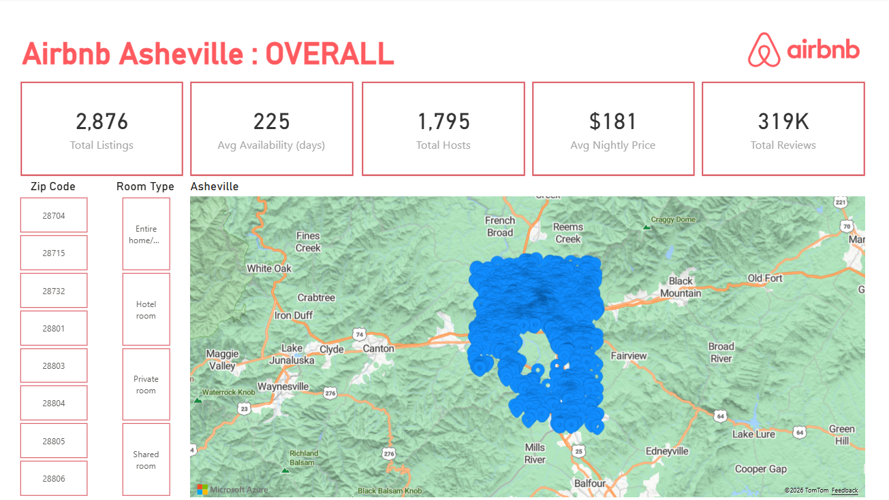
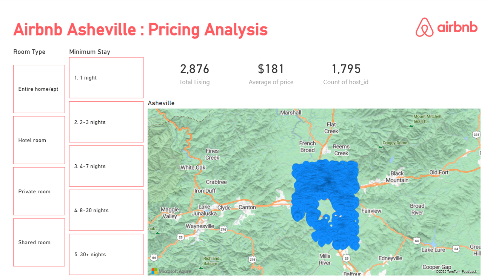
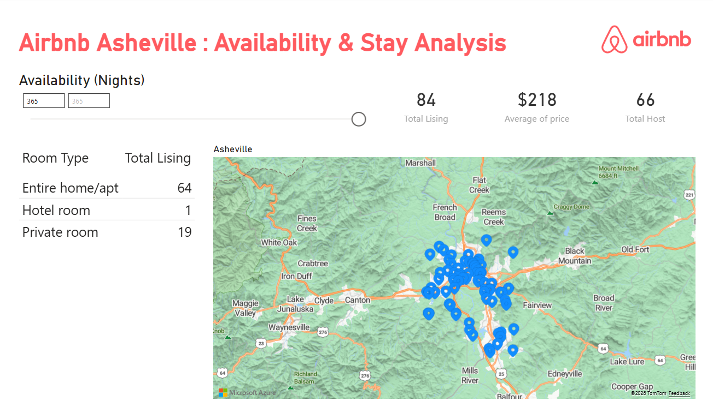

# Airbnb Asheville : Market Analysis

## Business Context
This analysis responds to a market expansion brief exploring Asheville, NC 
as a potential Airbnb target market. The dataset covers 2,876 listings and 
319K total reviews sourced from Inside Airbnb.

## Credit
Dataset and analysis brief provided by [Analyst Builder](https://www.analystbuilder.com/projects/asheville-airbnb-listings-analysis-hQNaU?tab=details).

## Tools Used
- MySQL (data preparation, validation, and analysis)
- Power BI (visualization and dashboard)

## Data Preparation
- Inspected listings.csv and reviews.csv for missing values
- Identified and flagged outliers in nightly price
- Merged reviews.csv with listings.csv to connect review activity to listing details
- Noted that neighbourhood_group field is blank across all records

## Pricing Insights
- Average nightly price is $181 across all listings
- Entire home/apt listings command the highest average price
- Minimum stay requirements show a positive correlation with average price
- Longer minimum stays tend to appear in higher-priced listings

## Neighborhood and Host Activity
- Listings are concentrated in central Asheville zip codes
- Top active zip codes: 28801, 28803, 28804, 28805
- Top host by listing count is Towns (167186184) with 107 listings
- Market shows reliance on a small number of large operators
- 1,215 out of 2,876 listings belong to single-listing hosts

## Review Activity and Demand
- Total reviews: 319K across all listings
- Review activity indicates strong and consistent guest demand
- Entire home/apt accounts for 2,357 listings, showing dominant preference

## Recommendations
**Expand into Asheville.** Key reasons:
- Strong demand signal from 319K reviews across 2,876 listings
- Average nightly price of $181 indicates healthy revenue potential
- Entire home/apt segment dominates, suggesting opportunity for 
  property-focused investment

**Target neighborhoods:** Central zip codes 28801 and 28803 show the 
highest listing concentration and activity.

**Risks to consider:**
- Market is concentrated among a few large hosts such as Towns and Yonder
- Seasonal demand spikes may affect occupancy consistency
- 340 listings have no price data, suggesting incomplete market visibility

## Dashboard
[Watch Dashboard Walkthrough](https://www.youtube.com/watch?v=DiSzcgkABgI)

## Preview

